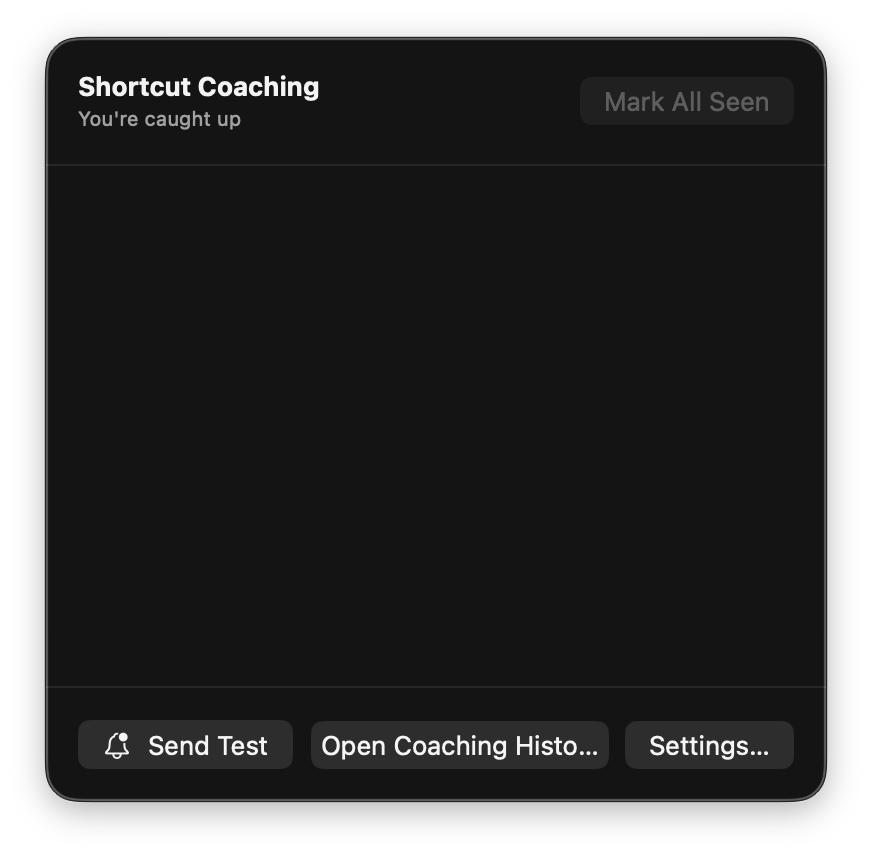
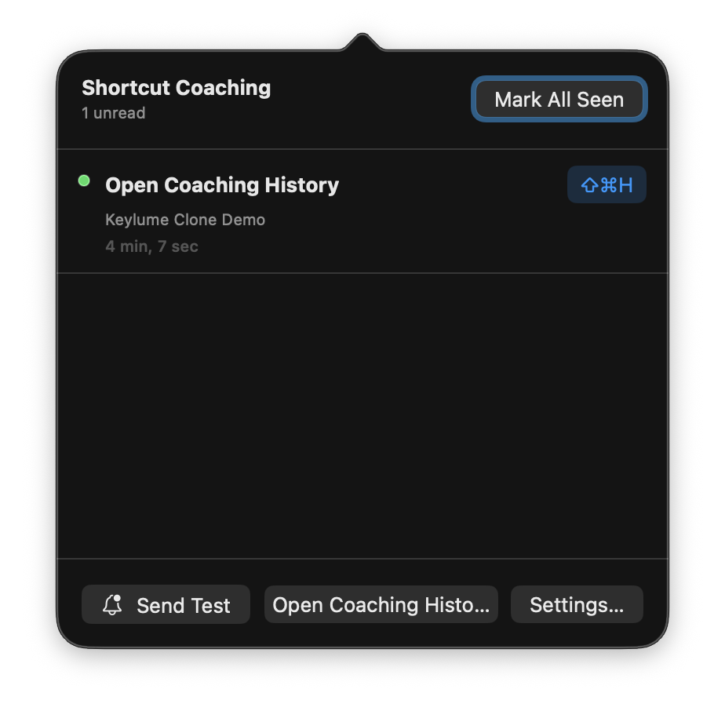
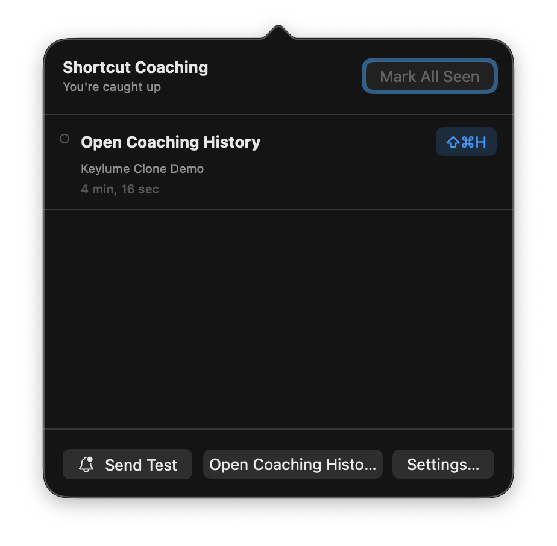
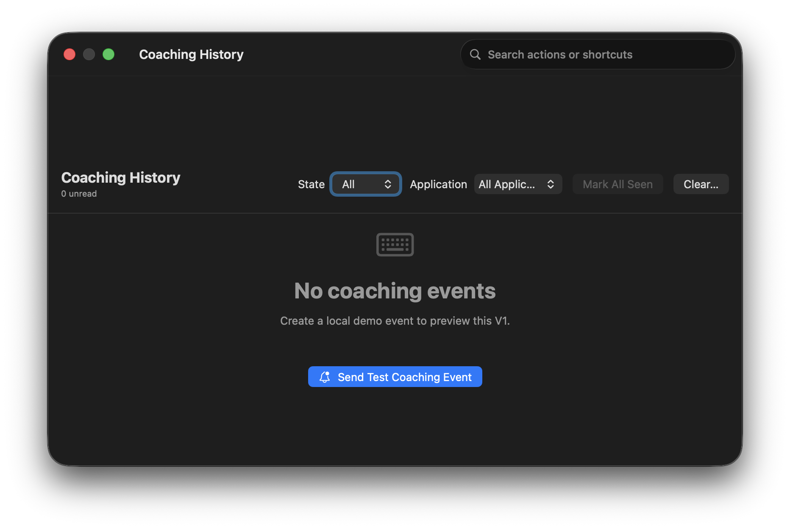
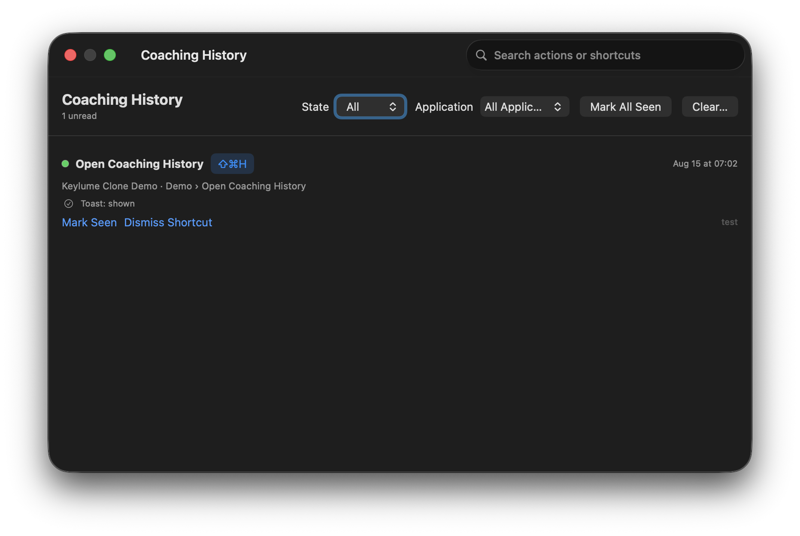
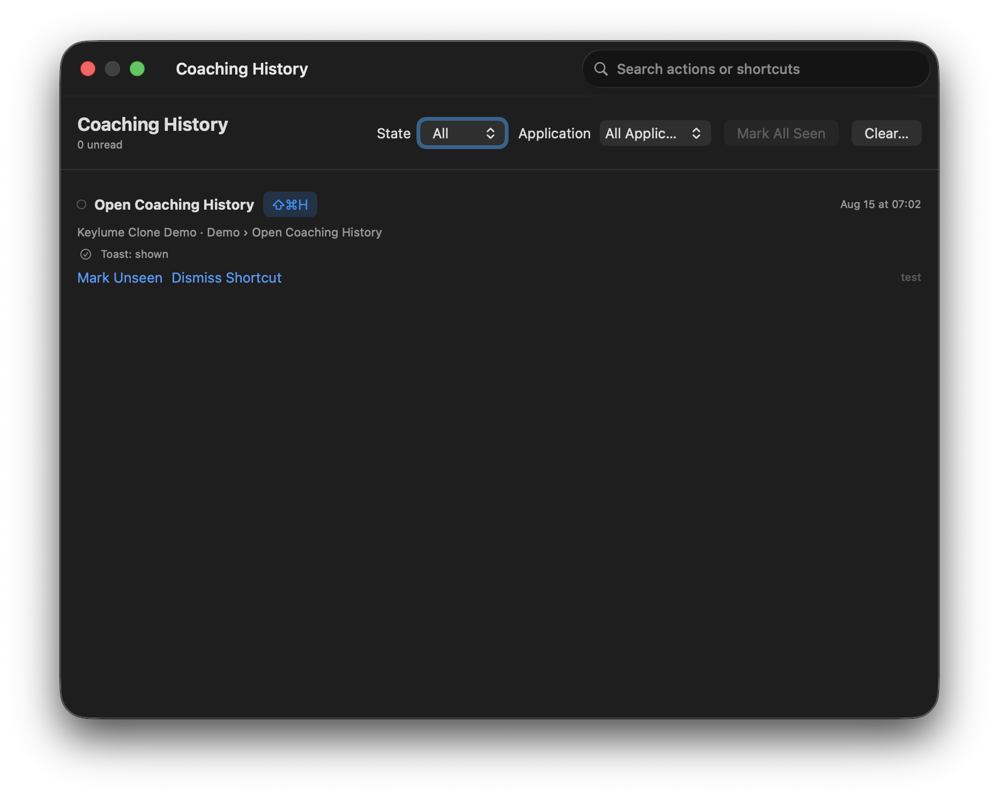
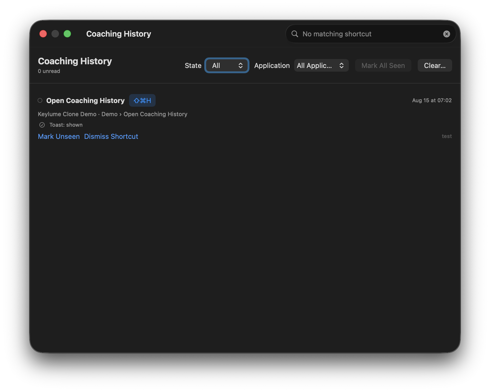
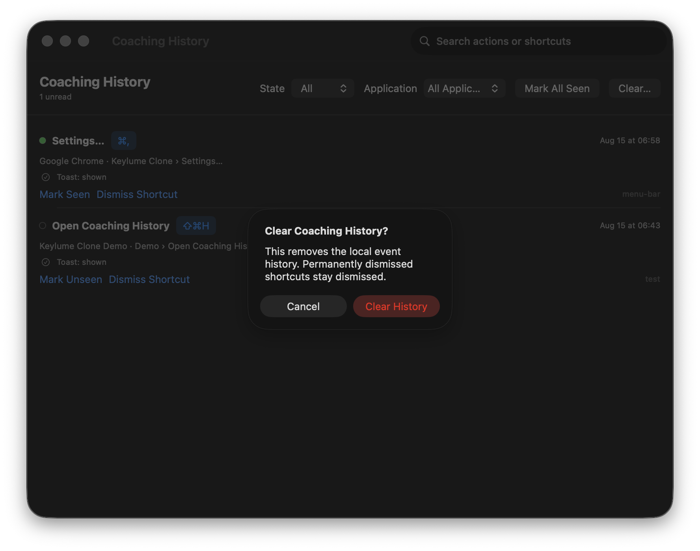
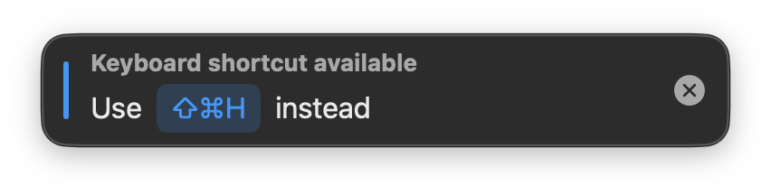
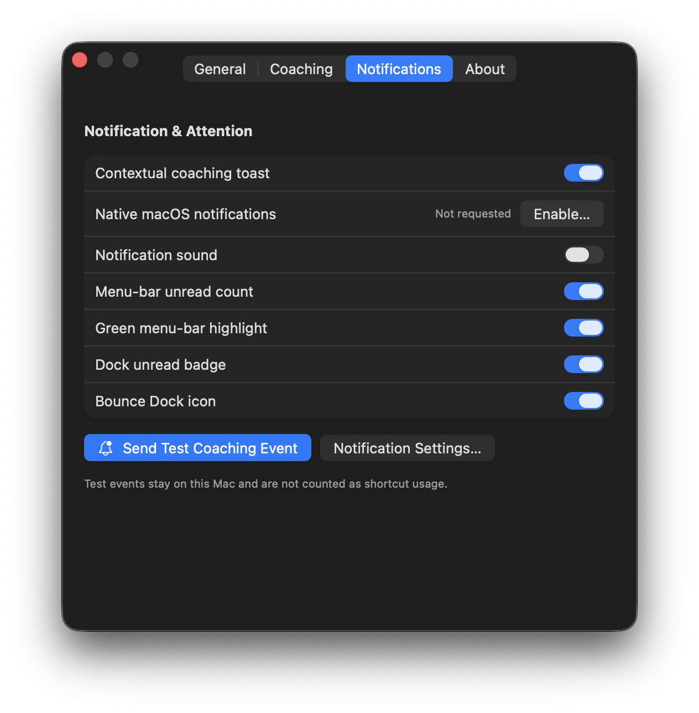

# Issue #4 — Gitify-style coaching inbox V1 gallery

These captures come from the signed universal package built from
`feat/4-gitify-coaching-inbox`. They are screenshots of the running app, not
mockups. Each app-owned surface is isolated so the gallery does not expose
other applications or private desktop content.

Build and launch the same artifact:

```sh
zsh scripts/package_app.sh release 'Apple Development: Matthew Schumacher (HPFTJKTXHX)'
open -n .build/release/KeylumeClone.app
```

## Menu-bar coaching inbox

| State | Evidence | Requirement covered |
| --- | --- | --- |
| Empty / zero unread |  | Durable inbox remains available when no events exist; zero-unread summary and disabled seen action. |
| Populated / unread |  | Expanded popover, unread summary and green unread marker, shortcut, source, relative time, mark-seen action, and history/settings routes. |
| Populated / seen |  | Read state remains in the durable inbox while unread marker and count clear. |

The native status item itself was verified through macOS Accessibility in both
states: `Keylume Clone, no unread coaching` with an empty title and `Keylume
Clone, 1 unread coaching items` with title `1`. On this capture machine the
item is placed in the menu-bar overflow/camera-notch exclusion region because
the menu bar is already full, so a clean still cannot honestly show its icon.
The popover anchor above is visible and the count/state remain testable through
the exact running artifact. A human demo on a menu bar with available space is
still required to visually approve the neutral icon and green unread tint.

## Coaching History

| State | Evidence | Requirement covered |
| --- | --- | --- |
| Empty |  | Empty state and local test-event call to action. |
| Populated / unread |  | Durable unread row, unread total, filters, application selector, search, seen and clear actions. |
| Populated / seen |  | A read event remains available while unread total becomes zero. |
| Search with no results |  | Search is active and produces a distinct filtered state without deleting history. |
| Clear confirmation |  | Destructive history clearing requires explicit confirmation and explains that settings remain. |

The `All` state is shown above. The state and application filter controls are
visible in every history capture; their selection behavior shares the same
filtered-event seam exercised by search. No additional screenshot was added
for a visually identical one-row filter result.

## Attention surfaces and preferences

| Surface | Evidence | Requirement covered |
| --- | --- | --- |
| Custom coaching toast |  | Compact non-activating coaching presentation with shortcut and dismissal control. |
| Notification & Attention settings |  | Toast, native notification authorization, sound, menu unread count, green highlight, Dock badge, Dock bounce, test event, and System Settings route. |

## OS-owned states not represented by still images

- **Dock badge:** the app sets `NSApplication.dockTile.badgeLabel` from the
  durable unread count, and the deterministic suite covers enabled/disabled
  behavior. The Dock auto-hides on this capture machine and no isolated still
  was obtained without unrelated Dock content.
- **Dock attention animation:** `requestUserAttention` is rate-limited and
  covered by deterministic tests, but a still image cannot prove an animation.
- **Native authorization/banner:** the settings screenshot honestly shows
  `Not requested`. Authorization was not changed merely to manufacture proof,
  and macOS Focus/scheduled delivery means the app can prove only that the
  system accepted a request—not that a banner was visibly delivered.

These remain human-demo checkpoints; they are not claimed as screenshot-proven.
