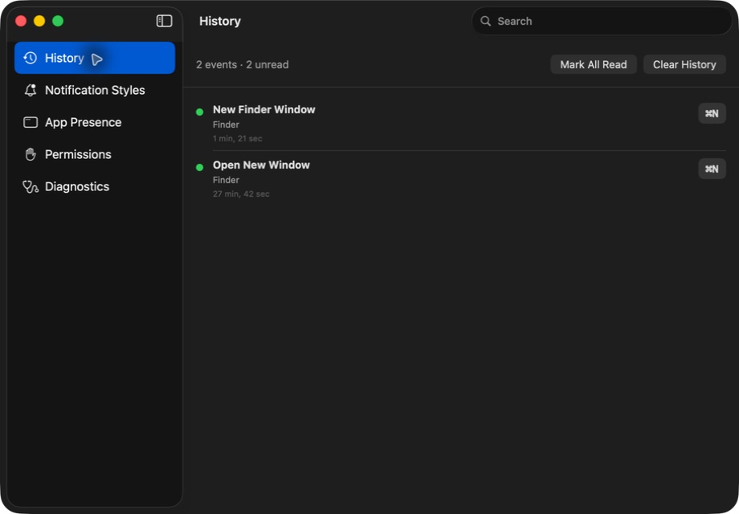

# Fresh foundation runtime evidence

## Real manual-action path — 2026-08-16

Artifact:

- `.derived/Build/Products/Debug/ShortcutCoach.app`
- Bundle ID `co.serp.shortcutcoach`
- Developer ID team `847HR8U8D9`
- Source commit before evidence capture: `40a90654b9391966a1c7b0185390e068c6ed9bcb`

Procedure and observations:

1. Reset only the stale Accessibility entry for `co.serp.shortcutcoach` and registered the exact signed artifact.
2. System Settings showed `ShortcutCoach.app` enabled under Privacy & Security → Accessibility.
3. Diagnostics reported `Monitoring manual menu-item clicks`.
4. The human physically clicked Finder → File → New Finder Window.
5. The human reported that the selected transient notification appeared.
6. History gained `New Finder Window` in `Finder` with shortcut `⌘N` and unread state.
7. After terminating and relaunching the exact artifact, the event and unread count remained and the detector returned to Monitoring.

This proves one end-to-end manual menu-item path. It does not yet prove Chrome tab clicks, non-menu controls, every supported application, or every selectable notification channel.

