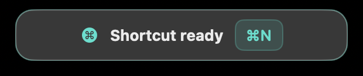
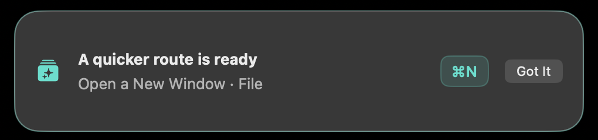
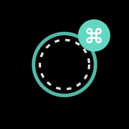
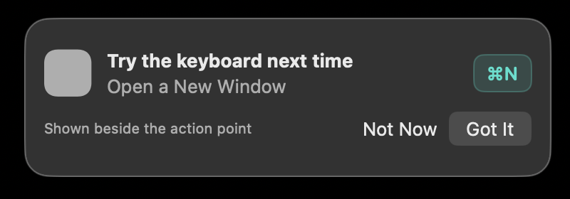
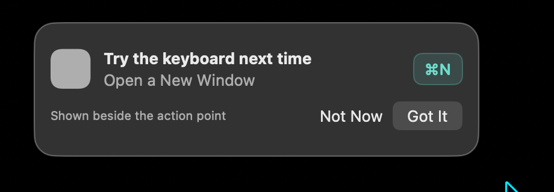
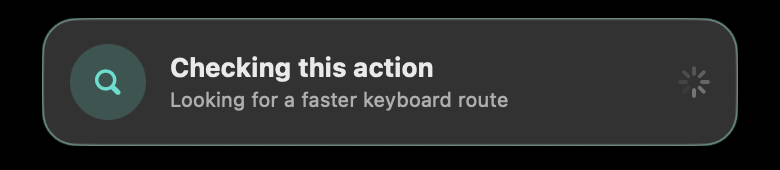
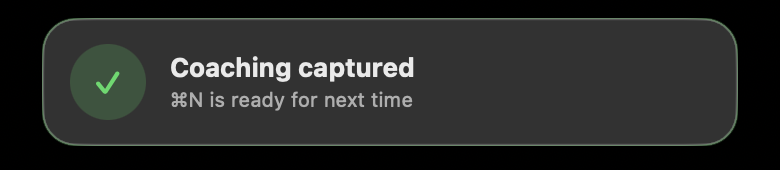
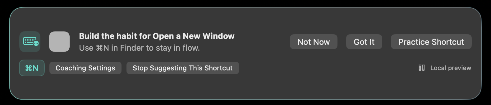
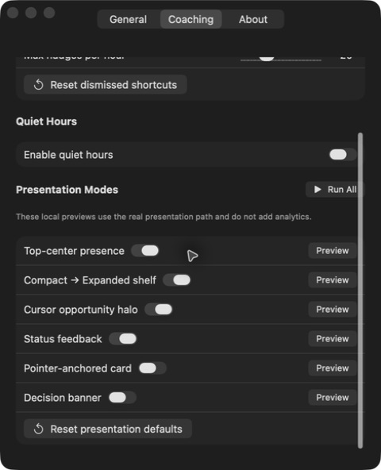

# Issue #5 presentation gallery

This gallery records the exact UI rendered by the packaged issue #5 build on branch `feat/5-heyclicky-presentation-modes`. The artifact was rebuilt as a universal, ad-hoc-signed app at `.build/release/KeylumeClone.app`; every other running `co.serp.KeylumeClone` executable was resolved by path and stopped before capture. Images are tightly cropped to app-owned UI and contain no unrelated app content.

The captures are evidence for this experimental presentation branch, not a parity claim for the broader clone objective.

## Requirement coverage

| Issue requirement or review state | Evidence | Result |
| --- | --- | --- |
| Reserved top-center / compact shelf | [01](01-top-center-compact-presence.png) | Exact packaged compact state. |
| Compact → expanded coaching shelf | [01](01-top-center-compact-presence.png), [02](02-expanded-coaching-shelf.png) | Exact endpoints. The transition is time-based and is additionally visible in the [Clipy demo](https://clipy.online/video/kxpp3vf1uakl). |
| Cursor opportunity halo | [03](03-cursor-opportunity-halo.png) | Exact expanded halo endpoint at the event pointer. |
| Pointer-anchored coaching card | [04](04-pointer-anchored-coaching-card.png) | Exact pointer-card content and actions. |
| Edge-aware pointer placement | [05](05-pointer-card-edge-flip.png) | The pointer is visible below/right of the card, proving that the card flipped to the safe side near the display edge. |
| Explicit status feedback | [06](06-status-evaluating.png), [07](07-status-success.png) | Exact evaluating and success states, including redundant icon, shape, color, and text cues. |
| Actionable decision banner | [08](08-actionable-decision-banner.png) | Exact primary `Practice Shortcut`, defer `Not Now`, dismiss `Got It`, settings, and stop-suggesting actions, plus shortcut and local-preview chips. |
| Settings controls and previews | [09](09-settings-presentation-controls.png) | All six enable switches, per-mode Preview buttons, Run All, safe defaults, and reset action. |
| Menu-bar Presentation Showcase triggers | [AX evidence](menu-bar-showcase-ax.txt) | All six individual triggers, Run All, and Hide Showcase are present in the exact packaged app. A clean still was blocked by macOS culling the extra behind the current crowded/notched menu bar. |

## Captures

### 1. Reserved top-center compact presence

### 2. Expanded coaching shelf

### 3. Cursor opportunity halo

### 4. Pointer-anchored coaching card

### 5. Pointer-card edge flip

### 6. Status: evaluating

### 7. Status: success

### 8. Actionable decision banner

### 9. Presentation settings and previews

## What a still image cannot prove

- The compact-to-expanded shelf timing and the evaluating-to-success transition require motion evidence; the paired endpoints above and the existing [Clipy demo](https://clipy.online/video/kxpp3vf1uakl) cover them together.
- Reduce Motion uses a static halo diameter and disables the top-panel frame animation through the live macOS accessibility setting. Its final still is intentionally visually equivalent, so changing a user OS setting solely for a duplicate endpoint would not add evidence.
- `paused`, permission-required, and failed phases exist in the bounded state model and accessibility semantics, but the current packaged status-feedback showcase visibly implements only evaluating and success. They are not represented as shipped visual states in this gallery.
- Button side effects, suppression/dedupe, action ordering, accessibility labels, and display placement bounds are deterministic test evidence rather than still-image claims.
- The menu-bar showcase hierarchy is captured in [AX evidence](menu-bar-showcase-ax.txt). Its icon was culled by the current Mac's menu-bar capacity; unrelated status apps and the user's persistent menu layout were deliberately left untouched.

## Screenshot-review fix

The first capture pass exposed a lifecycle bug: the expanded shelf reached its target frame and immediately disappeared because scheduling dismissal canceled the active transition task. Transition and dismissal tasks now have independent registry slots, with regression coverage proving that installing a dismissal cannot cancel an active state transition.
